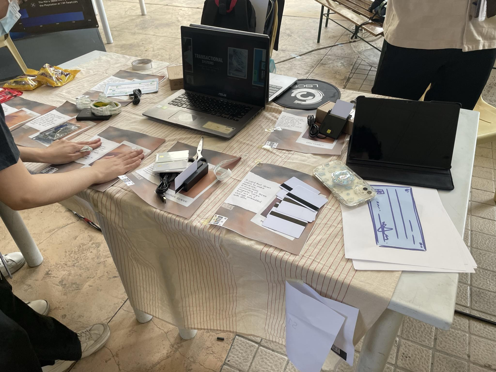

# [CSARCH2] S14 GROUP 9 - Documentation

## 1. Video Used During Exhibit

- **Description:** The video showcases our team members discussing the project, its features, and its significance. Each member is physically seen in the video, ensuring clarity and liveliness.
- **Duration:** 9 minutes 8 seconds
- **Link:** [Watch Video](https://drive.google.com/file/d/1PCFQrm5ZYI2iGayL8F9vaor8D9sp4B2x/view?fbclid=IwAR2hudFNGj1Zduprxt5LHdu8Dpo1WgOF0ZTATeIxyJ0ZNgmOKzPAqYtta8s)
  
## 2. Documentation Collage

### Before Booth Setup

- Initially, booth setup proved challenging as lighter components were at risk of getting blown away.

- In this image, our team can be seen setting up the booth. To address the challenge of lighter components, we improvised by taping them onto a board that already had descriptions. This allowed us to secure the components and prevent them from being displaced.

### After Booth Setup

- These images depict the fully set up booth. The placement of components follows a timeline format, strategically organized from left to right. This layout allows visitors to navigate through the project's progression, from its inception to its current state, in a clear and structured manner.

- Our exhibit showcased the evolution of transactional systems through components such as EMV chip cards and readers for enhanced security, alongside NFC technology demonstrating the rise of contactless transactions.

### Members Manning the Booth
- **Day 1:** [Insert picture/video with timestamp]
- **Day 2:** [Insert picture/video with timestamp]

### Guests Visiting and Inquiring
- [Insert picture/video of guests with annotations]

### Flyers Used During Exhibit
- [Insert picture/video of flyers used]

### Other Gimmicks Used
- [Describe any other gimmicks used during the exhibit]
